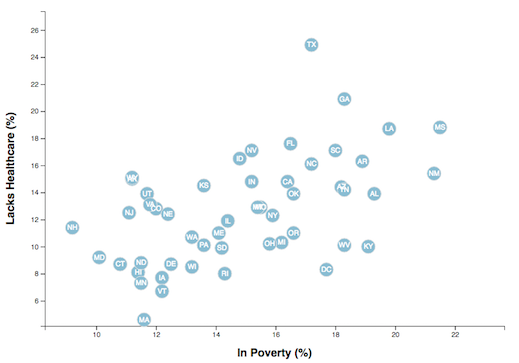

# Data-Journalism-and-D3_16

 Our project is published at https://nanysylviane.github.io/Data-Journalism-and-D3_16/

## Background

Our task is to analyze the current trends shaping people's lives, as well as creating charts, graphs, and interactive elements to help readers understand your findings.

The data set : [https://factfinder.census.gov/faces/nav/jsf/pages/searchresults.xhtml]

The current data set incldes data on rates of income, obesity, poverty, etc. by state. MOE stands for "margin of error."

### Our Task

# Level 1: D3 Dabbler
Create a scatter plot between two of the data variables such as `Healthcare vs. Poverty` or `Smokers vs. Age`using d3 techniques 
* Include state abbreviations in the circles.
* Create and situate your axes and labels to the left and bottom of the chart.

# Level 2: 

## Copyright

Data Boot Camp © 2018. All Rights Reserved.
